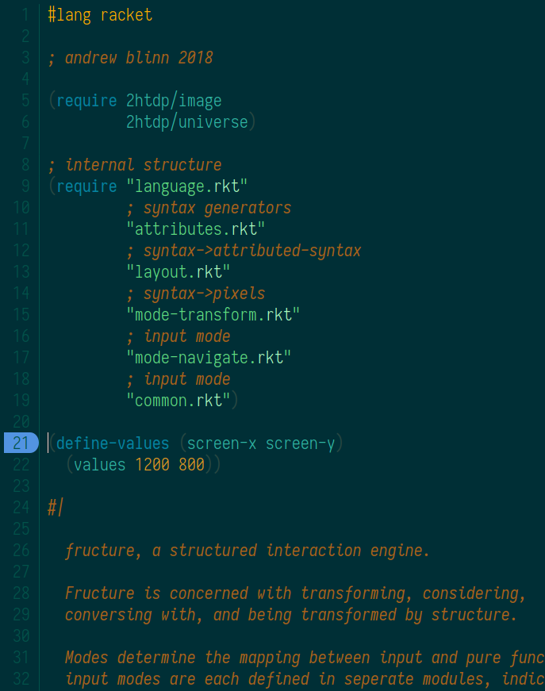
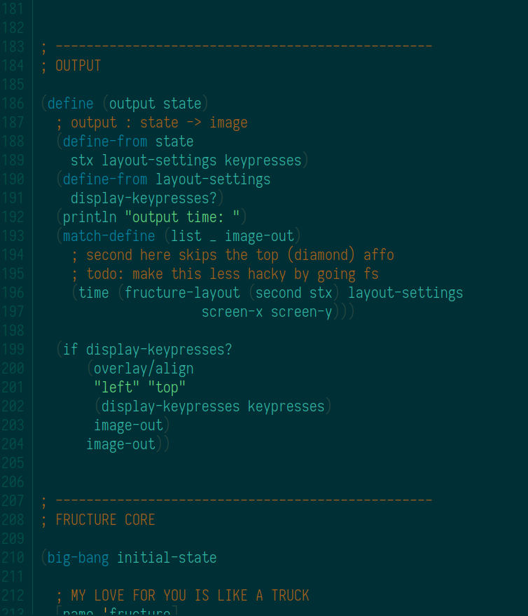
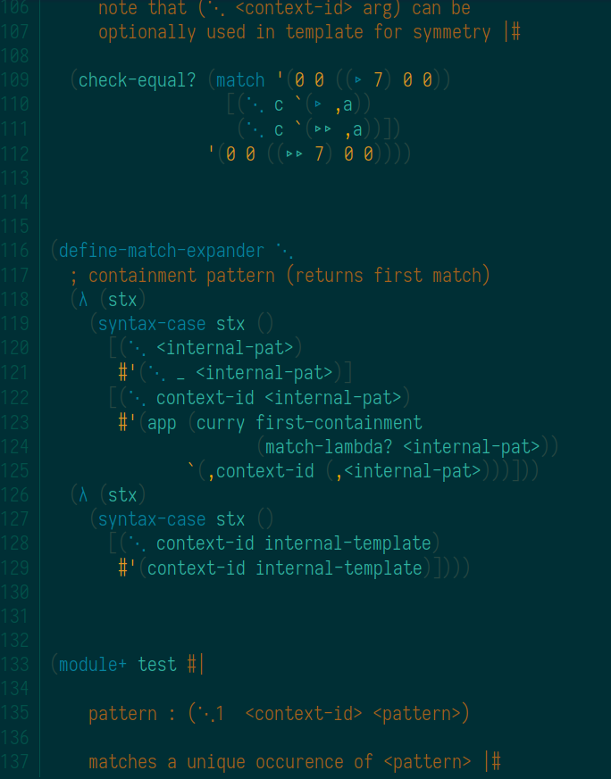
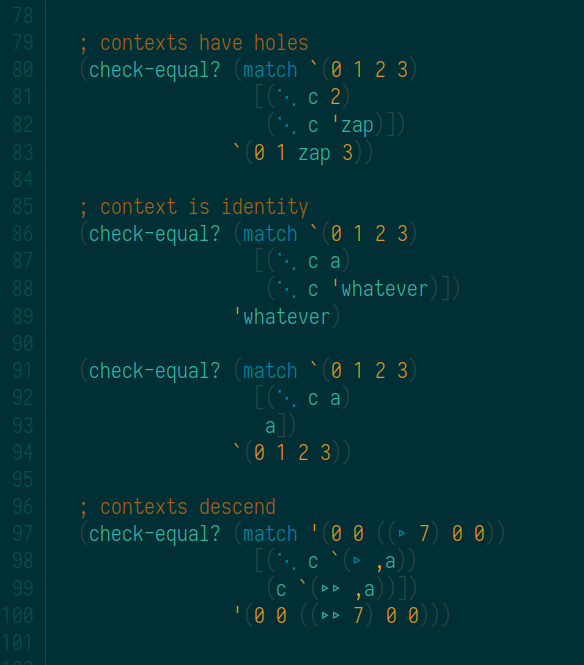
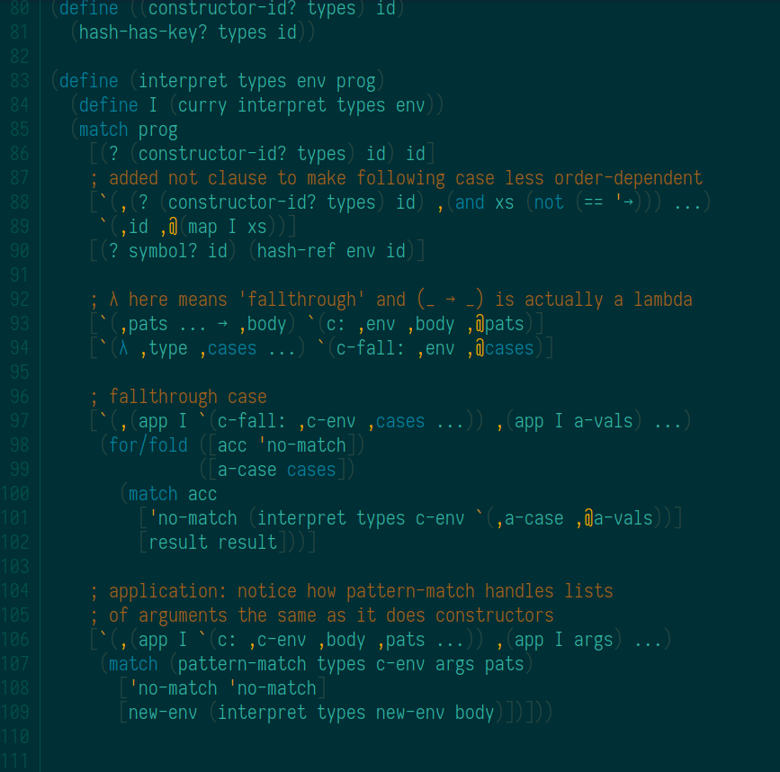
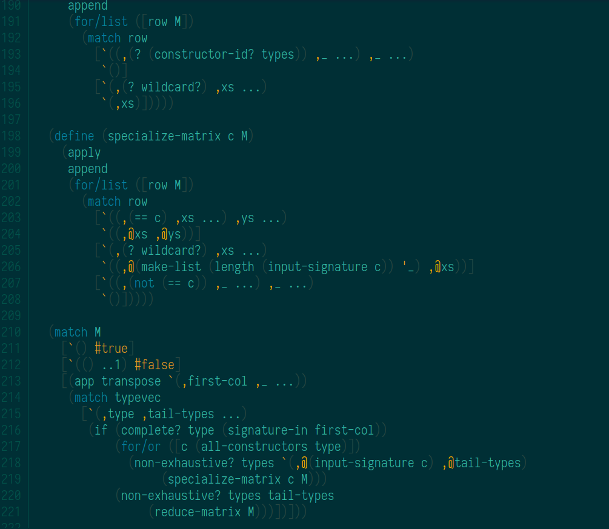
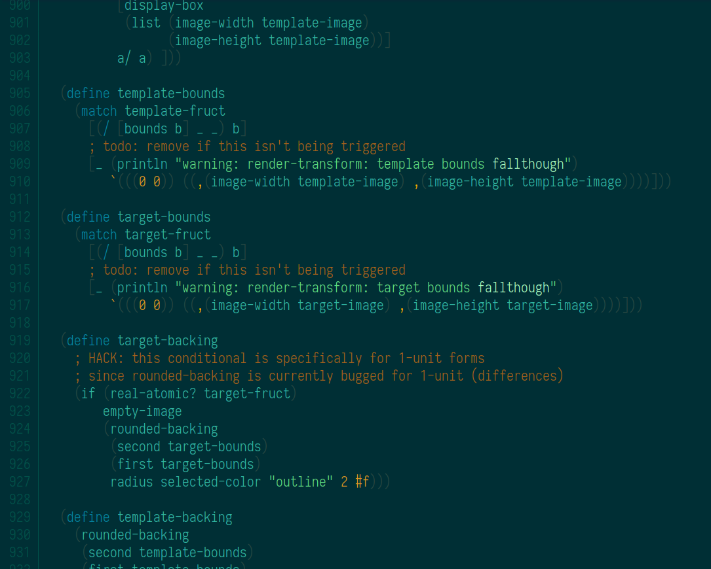

Submerged color scheme for Dr Racket 6.0+
=========================================

Based on [solarized for drracket by takikawa](https://github.com/takikawa/drracket-solarized), an implementation of [solarized by ethan schoonover](http://ethanschoonover.com/solarized).

Installation:
=============
  * `raco pkg install git://github.com/disconcision/drracket-submerged`

